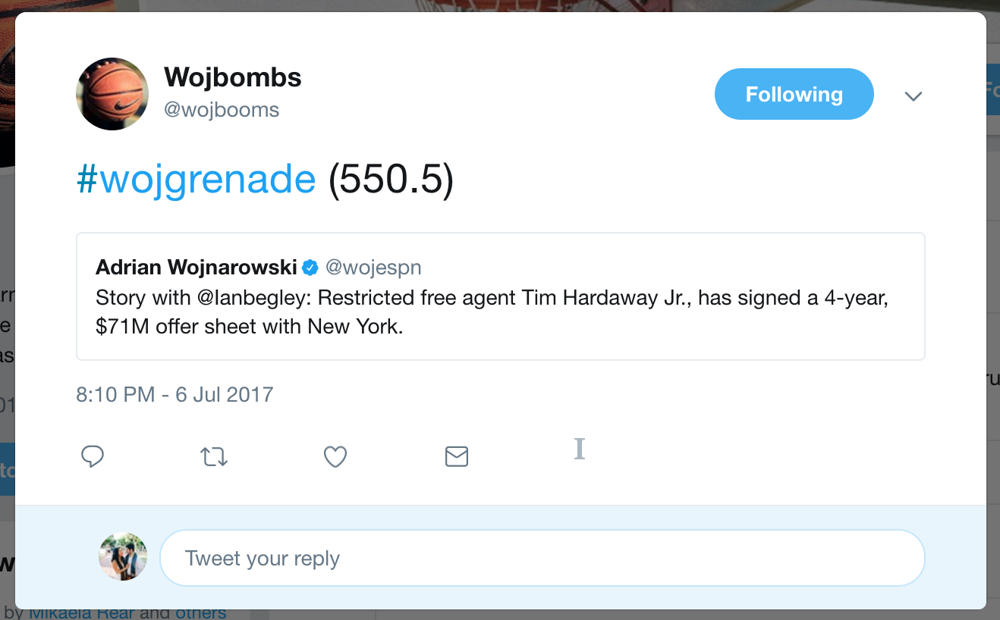

[Wojbombs](https://www.twitter.com/wojbombdetector)
========

Visit the bot `@WojbombDetector`.

This is a Twitter bot that re-tweets each original Woj tweet and classifies it according to how likely it thinks the news will shake-up the NBA.

Context
=======

[Adrian Wojnarowski](http://www.twitter.com/wojespn) is a well-known NBA reporter. Over the past several years, he has broken several major stories about the NBA, mostly notably about where players were headed during Free Agency. NBA fans on the internet used the label `wojbombs` for these news tidbits, with `woj`+`nukes` or some other `woj`+ballistic combination depending on the 'bigness' of the news. This bot attempts to perform this classification automatically. 

How it Works
============

The machine learning element is at the moment very, very naive. It takes in the past 3,000 or so tweets from Woj, filters it to only those that aren't retweets, and then runs a bi- and tri-gram CountVectorizer across the tweets. I then build a Random Forest Regression model off of this tweet word matrix, with my target column the number of retweets the tweet received (so the model is biased against very recent tweets, which may not have had enough time to reach their potential -- but also biased against older tweets as presumably Woj picked up followers over time). 

I pickle this model, and then run each new tweet through it. To grab new tweets, I use Tweepy for access to the Twitter Stream, and filter the stream by original Woj tweets only.

I then retweet the Woj tweet, along with the number of eventual retweets that the bot predicts it will have.

Most of the future work for this bot will be in the machine learning part, I still have to:
1. Implement grid search
2. Use some scoring function for accuracy measurement
3. Try different models besides Random Forests
4. Try uni-grams, or quad-grams, or fiddle with the Vectorizer some other way

Update (Jul. 12):
1. Scraped posts from Reddit's `/r/NBA` subreddit but the number of posts with `Wojnarowski` was only about 1,000 posts, fewer than the 3,000 Woj tweets.
2. Experimented with a few other models, so far Ridge Regression seems to be performing the best anecdotally, but I haven't switched out the model yet.
3. My laptop freezes when attempting to run scikit's GridSearch, so I've put off experimenting with different models, as the current model works okay enough as a proof-of-concept.
4. There hasn't been a Woj-bomb yet, which is unfortunate because I want to retweet that tweet ASAP.

To host and run this script, I'm using [Dokku](https://github.com/dokku/dokku/) on a DigitalOcean droplet.

Also, I'm mildly uncomfortable with using just violent words as descriptors, so if you have any suggestions, please send them my way.
